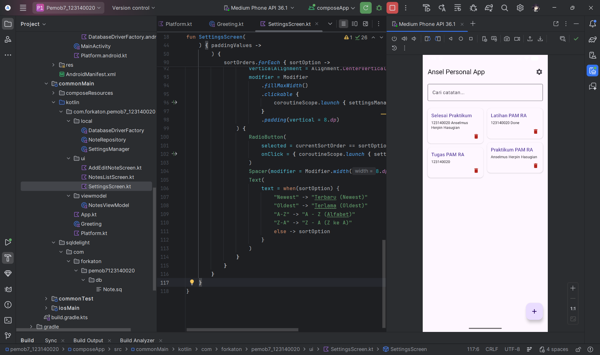

# KMP Ansel Personal App - Praktikum Pengembangan Aplikasi Mobile

[](https://kotlinlang.org)
[](https://www.jetbrains.com/lp/compose-multiplatform/)
[](https://cashapp.github.io/sqldelight/)
[](https://github.com/russhwolf/multiplatform-settings)

Repositori ini merupakan implementasi **Praktikum Minggu 7** pada mata kuliah **Pengembangan Aplikasi Mobile**.  
Proyek ini menampilkan pengembangan aplikasi **"Ansel Personal App"** berbasis **Kotlin Multiplatform (KMP)** dengan pendekatan **Offline-First Architecture**, mengintegrasikan database lokal, manajemen preferensi pengguna, dan sistem UI reaktif secara *real-time*.

---

## Informasi Mahasiswa

**Anselmus Herpin Hasugian**  
NIM: **123140020**  
Kelas: **RA**  
Program Studi: **Teknik Informatika**  
Institut Teknologi Sumatera (**ITERA**)

---

## Tech Stack & Library

Aplikasi ini dibangun menggunakan teknologi modern untuk memastikan performa yang responsif, stabil, dan tetap optimal dalam kondisi *offline*.

### Core Technology

- **Compose Multiplatform**  
  Framework UI deklaratif untuk pengembangan aplikasi Android dan iOS.

- **SQLDelight**  
  Library database *type-safe* berbasis SQL murni untuk operasi SQLite yang cepat dan aman.

- **Multiplatform Settings (Russhwolf)**  
  Solusi penyimpanan preferensi lintas platform sebagai implementasi *DataStore/SharedPreferences*.

- **Kotlin Coroutines & Flow**  
  Digunakan untuk pengelolaan state reaktif dan pembaruan UI secara otomatis menggunakan `combine` dan `flatMapLatest`.

---

## Fitur Proyek

### 1. Manajemen Database SQLDelight (CRUD)

#### ✦ Create & Read
- Menambahkan catatan baru dengan *timestamp* otomatis.
- Membaca data secara asinkron menggunakan `Flow`.

#### ✦ Update & Delete
- Memperbarui isi catatan secara dinamis.
- Menghapus catatan dari penyimpanan lokal perangkat secara aman.

---

### 2. Pengaturan Preferensi & Tema Kustom (DataStore)

#### ✦ Real-time Theme Switching
Mendukung beberapa mode tampilan:
- Light Mode
- Dark Mode
- Custom Theme: **Navy Ocean**

#### ✦ Dynamic Sorting
Pengurutan catatan secara instan berdasarkan:
- Newest
- Oldest
- A-Z
- Z-A

---

### 3. UI/UX Modern & Pencarian

#### ✦ Staggered Grid Layout
Menggunakan `LazyVerticalStaggeredGrid` dengan tampilan dinamis ala Pinterest.

#### ✦ Live Search
- Pencarian real-time berdasarkan judul dan isi catatan.
- Terintegrasi langsung dengan logika sorting pada `ViewModel`.

#### ✦ Proper UI States
Menampilkan *Empty State* ketika:
- Tidak ada catatan
- Hasil pencarian kosong

---

## 🗄️ Database Schema (Note.sq)

Struktur tabel SQLite utama yang di-*generate* menggunakan SQLDelight.

```sql
CREATE TABLE Note (
    id INTEGER PRIMARY KEY AUTOINCREMENT,
    title TEXT NOT NULL,
    content TEXT NOT NULL,
    created_at INTEGER NOT NULL
);

selectAll:
SELECT * FROM Note ORDER BY created_at DESC;

search:
SELECT * FROM Note
WHERE title LIKE ('%' || :query || '%')
OR content LIKE ('%' || :query || '%')
ORDER BY created_at DESC;

insert:
INSERT INTO Note(title, content, created_at)
VALUES (?, ?, ?);

update:
UPDATE Note SET title = ?, content = ?
WHERE id = ?;

delete:
DELETE FROM Note WHERE id = ?;
```

---

## 📂 Struktur Folder (Clean Architecture)

Pemisahan *concern* antara data layer, business logic, dan antarmuka pengguna.

```plaintext
composeApp/src/commonMain/kotlin/com/forkaton/pemob7_123140020/
├── local/           # SQLDriver, Repository, SettingsManager
├── viewmodel/       # NotesViewModel (combine search & sorting Flow)
├── ui/              # Screen UI aplikasi
├── App.kt           # Entry point, navigation, dan theme injection
└── sqldelight/      # File Note.sq
```

---

## ✅ Ceklis Rubrik Penilaian

Seluruh poin implementasi pada praktikum Minggu 7 telah berhasil diselesaikan.

| Komponen Rubrik | Status | Implementasi |
|---|---|---|
| SQLDelight Setup | ✔️ | Driver, schema (`Note.sq`), dan query berhasil dikonfigurasi |
| CRUD Operations | ✔️ | Tambah, baca, edit, dan hapus data berjalan dengan baik |
| DataStore Settings | ✔️ | Preferensi tema dan sorting tersimpan secara real-time |
| Search Feature | ✔️ | Pencarian sinkron menggunakan `combine` pada ViewModel |
| UI/UX | ✔️ | Menggunakan staggered grid, custom theme, dan empty states |
| Code Quality | ✔️ | Struktur modular dengan Coroutines & Flow |
| Offline-First | ✔️ | Data dan settings tetap tersimpan setelah aplikasi ditutup |

---

## 🚀 Instalasi & Setup

### 1. Clone Repository

Pastikan menggunakan branch `week-7`.

```bash
git clone -b week-7 https://github.com/forkaton/pemob7_123140020.git
```

---

### 2. Build Project

1. Buka project menggunakan **Android Studio**
2. Jalankan proses **Gradle Sync**
3. Pastikan menggunakan **JDK 17** atau **JDK 21**
4. Jalankan aplikasi pada emulator atau perangkat fisik

> **Catatan:**  
> Jika SQLDelight gagal melakukan proses build awal pada Windows, disarankan untuk menonaktifkan pengecualian folder project pada Windows Defender.

---

## 📸 Lampiran Tugas

### Screenshot
Tambahkan screenshot halaman berikut pada root repository:
- Home Screen



- Add/Edit Note Screen

- Settings Screen

---

### 🎥 Video Demo (±45 Detik)

Tambahkan tautan video demonstrasi pada bagian berikut.

```text
[Link Video Demo]
```

---

## ✨ Highlight Implementasi

Beberapa fokus utama dalam pengembangan aplikasi ini:

- Arsitektur **Offline-First**
- Integrasi **SQLDelight + Flow**
- Reactive State Management
- Penyimpanan preferensi lintas platform
- UI modern berbasis Compose Multiplatform
- Sinkronisasi pencarian dan sorting secara real-time

---

## © 2026

**Anselmus Herpin Hasugian**  
Institut Teknologi Sumatera (ITERA)