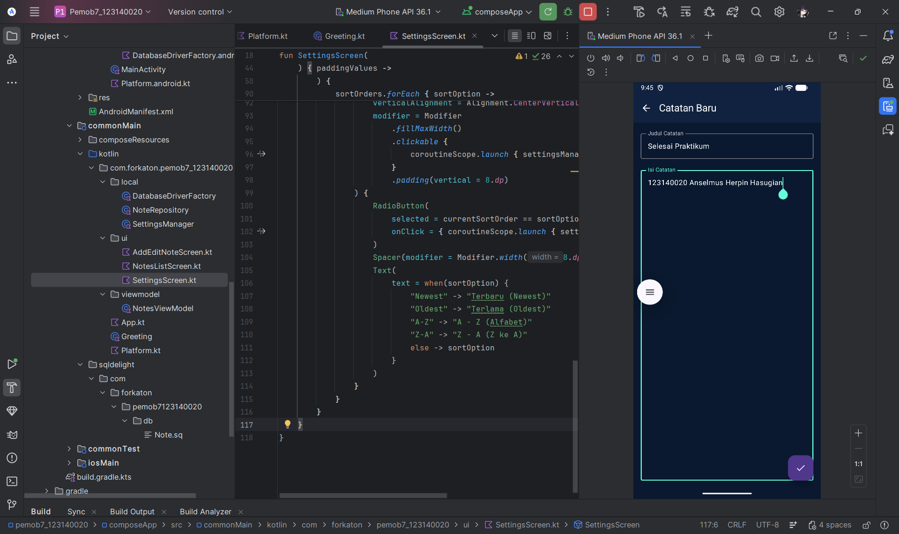
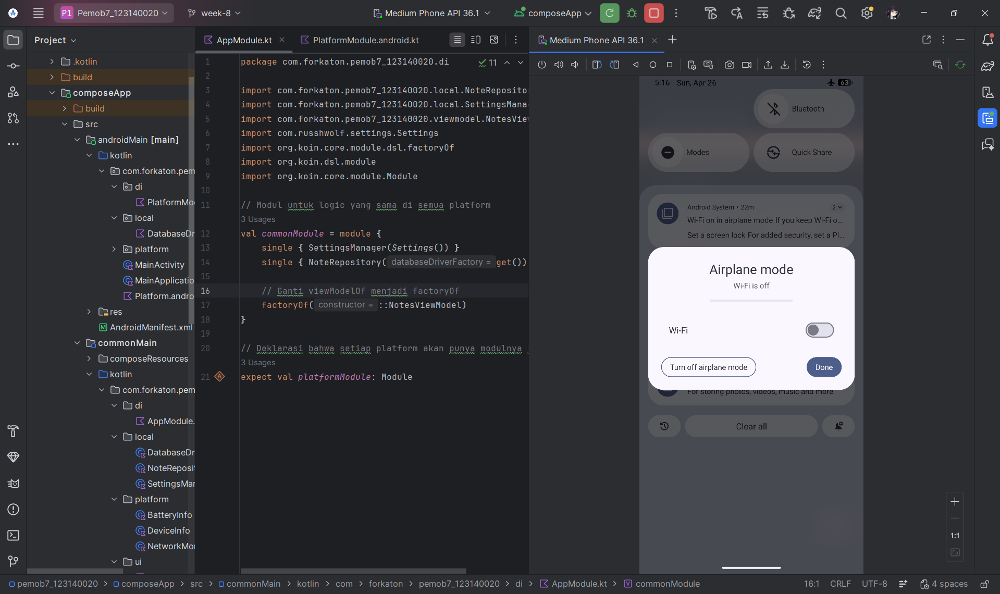
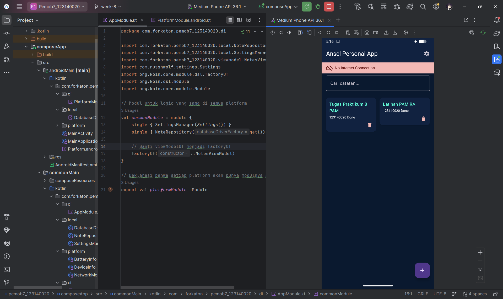
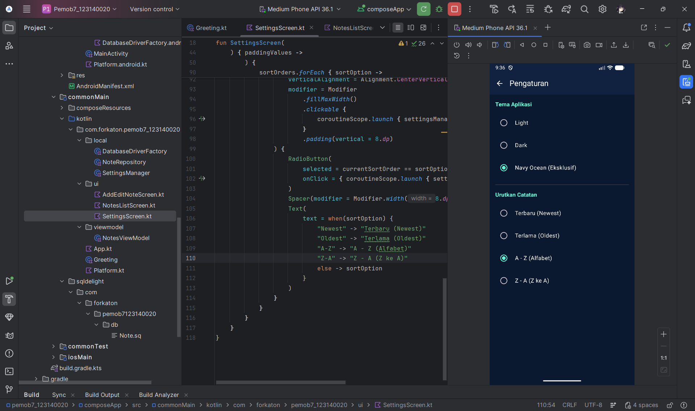
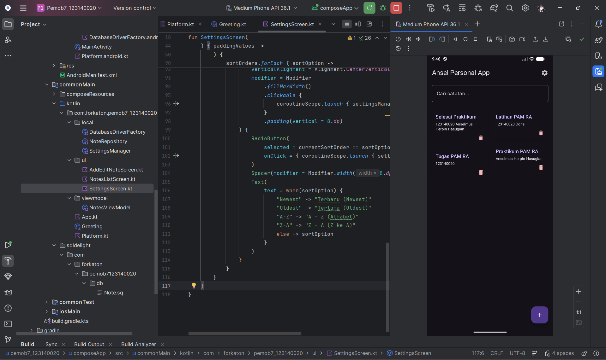

# 📱 Tugas Praktikum 8 — Platform-Specific Features

<div align="center">


**IF25-22017 — Pengembangan Aplikasi Mobile**
**Program Studi Teknik Informatika — Institut Teknologi Sumatera**
**Tahun Akademik Genap 2025/2026**

---

| 👤 Nama | Anselmus Herpin Hasugian |
|---|---|
| 🎓 NIM | 123140020 |
| 📚 Prodi | Teknik Informatika |
| 🏫 Institusi | Institut Teknologi Sumatera (ITERA) |
| 📅 Semester | 6 |
| 🖥️ Kelas | Pengembangan Aplikasi Mobile — RA |
| 🌿 Branch | `week-8` |

</div>

---

## 📋 Daftar Isi

- [Tentang Modul 8](#-tentang-modul-8)
- [Capaian Pembelajaran](#-capaian-pembelajaran)
- [Konsep Utama](#-konsep-utama)
    - [expect/actual Pattern](#1-expectactual-pattern)
    - [Dependency Injection dengan Koin](#2-dependency-injection-dengan-koin)
    - [Platform APIs](#3-platform-apis)
    - [Permissions](#4-permissions)
- [Latihan Hands-on](#-latihan-hands-on)
    - [Latihan 1: Device Info](#latihan-1-device-info)
    - [Latihan 2: Koin DI Setup](#latihan-2-koin-di-setup)
    - [Latihan 3: Network Status Indicator](#latihan-3-network-status-indicator)
- [Deskripsi Tugas Praktikum](#-deskripsi-tugas-praktikum)
- [Fitur yang Diimplementasi](#-fitur-yang-diimplementasi)
- [Arsitektur Aplikasi](#-arsitektur-aplikasi)
- [Struktur Project](#-struktur-project)
- [Setup & Konfigurasi](#-setup--konfigurasi)
- [Dokumentasi Screenshot](#-dokumentasi-screenshot)
- [Rubrik Penilaian](#-rubrik-penilaian)
- [Cara Testing](#-cara-testing)
- [Sumber Pustaka](#-sumber-pustaka)

---

## 📖 Tentang Modul 8

Modul 8 membahas tentang **Platform-Specific Features** dalam konteks **Kotlin Multiplatform (KMP)** dan **Compose Multiplatform**. Materi ini merupakan lanjutan dari Pertemuan 7 yang membahas Local Data Storage (DataStore, SQLDelight, Repository Pattern).

Pada pertemuan ini, fokus utama adalah bagaimana cara **mengakses fitur-fitur native** yang berbeda di setiap platform (Android & iOS) sambil tetap mempertahankan **shared code** yang bersih dan terstruktur di `commonMain`.

> **"Write once, adapt everywhere. That's the power of KMP."**
> — *Kotlin Multiplatform Philosophy*

---

## 🎯 Capaian Pembelajaran

**CPMK0502 dan CPMK0503** — Mahasiswa mampu menjelaskan dan menerapkan teknologi sistem cerdas dalam pengembangan perangkat lunak.

Setelah menyelesaikan modul ini, mahasiswa mampu:

- ✔️ Memahami dan menerapkan **expect/actual pattern**
- ✔️ Menggunakan **Koin** untuk Dependency Injection di KMP
- ✔️ Mengakses **platform-specific APIs** (Device Info, Battery, Network)
- ✔️ Mengelola **permissions** di multiplatform
- ✔️ Mengintegrasikan fitur native ke **shared code**

---

## 📚 Konsep Utama

### 1. expect/actual Pattern

`expect/actual` adalah mekanisme inti Kotlin Multiplatform untuk menulis kode yang **berbeda implementasinya di setiap platform**, namun memiliki **API yang sama** di common code.

```
commonMain          androidMain         iosMain
──────────          ───────────         ───────
expect class   →    actual class   +    actual class
expect fun          actual fun          actual fun
```

**Cara Kerja:**
- `expect` → Deklarasi API di common code (tanpa implementasi)
- `actual` → Implementasi spesifik di setiap platform
- Kotlin compiler memastikan setiap `expect` memiliki pasangan `actual`

**Contoh Sederhana:**

```kotlin
// commonMain/Platform.kt
expect fun getPlatformName(): String

fun greet(): String = "Hello from ${getPlatformName()}!"
```

```kotlin
// androidMain/Platform.android.kt
actual fun getPlatformName(): String {
    return "Android ${Build.VERSION.SDK_INT}"
}
```

```kotlin
// iosMain/Platform.ios.kt
actual fun getPlatformName(): String {
    return UIDevice.currentDevice.systemName()
}
```

**Output:**
- Android: `"Hello from Android 34!"`
- iOS: `"Hello from iOS!"`

**Kapan Menggunakan expect/actual?**

| Use Case | Keterangan |
|---|---|
| 🗄️ Database Driver | SQLDelight driver berbeda per platform |
| 📱 Device Info | Model, OS version, screen size |
| 🔐 Secure Storage | Keychain (iOS) vs Keystore (Android) |
| 📍 Location Services | GPS APIs berbeda per platform |
| 📷 Camera/Media | Akses kamera dan galeri |
| 🔔 Notifications | Push notification setup |
| 🌐 Network Monitor | ConnectivityManager vs NWPathMonitor |
| 🔋 Battery Info | BatteryManager vs UIDevice.batteryLevel |

---

### 2. Dependency Injection dengan Koin

**Dependency Injection (DI)** adalah design pattern dimana objek menerima dependencies-nya dari luar, bukan membuatnya sendiri.

**Perbandingan Tanpa DI vs Dengan DI:**

```kotlin
// ❌ TANPA DI — Tightly Coupled, Hard to Test
class NotesViewModel {
    private val repository = NoteRepository(
        AppDatabase(
            DatabaseDriverFactory(ctx)
        )
    )
}
```

```kotlin
// ✔️ DENGAN DI — Loosely Coupled, Easy to Test
class NotesViewModel(
    private val repository: NoteRepository  // Injected from outside
) : ViewModel() {
    // Easy to test with mock
    // Easy to swap implementation
}
```

**Keuntungan DI:**
- 🧪 **Testability** — mudah di-mock untuk unit testing
- 🧩 **Modularity** — setiap komponen independen
- 🔄 **Flexibility** — mudah ganti implementasi
- 🏗️ **Separation of Concerns** — tanggung jawab terpisah

**Mengapa Koin?**

| Fitur | Koin | Dagger/Hilt |
|---|---|---|
| Kotlin DSL | ✔️ Pure Kotlin | ❌ Annotation-based |
| Code Generation | ❌ Tidak perlu | ✔️ Diperlukan |
| KMP Support | ✔️ Full support | ❌ Android only |
| Learning Curve | 🟢 Mudah | 🔴 Kompleks |
| Overhead | 🟢 Minimal | 🟡 Lebih besar |

**Setup Koin di `build.gradle.kts`:**

```kotlin
kotlin {
    sourceSets {
        commonMain.dependencies {
            implementation("io.insert-koin:koin-core:3.5.3")
            implementation("io.insert-koin:koin-compose:1.1.2")
            implementation("io.insert-koin:koin-compose-viewmodel:1.1.2")
        }
        androidMain.dependencies {
            implementation("io.insert-koin:koin-android:3.5.3")
            implementation("io.insert-koin:koin-androidx-compose:3.5.3")
        }
    }
}
```

**Koin DSL Cheat Sheet:**

```kotlin
val myModule = module {
    // Singleton — satu instance untuk seluruh app lifecycle
    single { AppDatabase(get()) }

    // Factory — instance baru setiap kali dipanggil
    factory { NoteRepository(get()) }

    // ViewModel — managed by ViewModelStore
    viewModelOf(::NotesViewModel)

    // Named definition
    single(named("baseUrl")) { "https://api.example.com" }

    // Bind interface ke implementasi
    single<Repository> { RepositoryImpl(get()) }
}
```

**Cara Inject Dependencies:**

```kotlin
// Di ViewModel — Constructor Injection (otomatis oleh Koin)
class NotesViewModel(
    private val repository: NoteRepository,
    private val deviceInfo: DeviceInfo
) : ViewModel()

// Di Composable — koinViewModel()
@Composable
fun NotesScreen() {
    val viewModel: NotesViewModel = koinViewModel()
}

// Di Composable — koinInject() untuk non-ViewModel
@Composable
fun SettingsScreen() {
    val deviceInfo: DeviceInfo = koinInject()
}

// Lazy injection di class biasa
val repository: NoteRepository by inject()
```

---

### 3. Platform APIs

Platform APIs yang umum diakses dalam aplikasi mobile:

| API | Android | iOS |
|---|---|---|
| 📱 Device Info | `Build.MODEL`, `Build.VERSION` | `UIDevice.current` |
| 🔋 Battery | `BatteryManager` | `UIDevice.batteryLevel` |
| 📍 Location | `FusedLocationProvider` | `CLLocationManager` |
| 📷 Camera | `CameraX` | `AVCaptureSession` |
| 🔔 Notifications | `NotificationManager` | `UNUserNotificationCenter` |
| 🌐 Network | `ConnectivityManager` | `NWPathMonitor` |

---

### 4. Permissions

**Jenis-jenis Permission di Android:**

| Tipe | Cara Grant | Contoh |
|---|---|---|
| **Normal** | Otomatis saat install | `INTERNET`, `ACCESS_NETWORK_STATE`, `BLUETOOTH` |
| **Dangerous** | Harus minta ke user saat runtime | `CAMERA`, `LOCATION`, `CONTACTS`, `MICROPHONE` |

**Permission Flow:**
```
1. Check if permission granted
       ↓
2. If NOT granted → Show rationale (optional)
       ↓
3. Request permission
       ↓
4. Handle result (GRANTED / DENIED)
       ↓
5. Handle "Don't ask again" → Guide user to Settings
```

---

## 🛠️ Latihan Hands-on

### Latihan 1: Device Info

**Tujuan:** Implementasi `expect/actual` untuk mengakses informasi perangkat.

**Checklist:**
- [x] Create `expect class DeviceInfo()`
- [x] Android `actual` implementation
- [x] iOS `actual` implementation (stub)
- [x] Register di Koin module
- [x] Inject di Composable dengan `koinInject()`
- [x] Display info di Settings Screen

**Implementasi:**

```kotlin
// commonMain/platform/DeviceInfo.kt
expect class DeviceInfo() {
    fun getDeviceName(): String
    fun getOsVersion(): String
    fun getAppVersion(): String
}
```

```kotlin
// androidMain/platform/DeviceInfo.android.kt
actual class DeviceInfo actual constructor() : KoinComponent {
    actual fun getDeviceName(): String = Build.MODEL
    actual fun getOsVersion(): String = "Android ${Build.VERSION.RELEASE} (API ${Build.VERSION.SDK_INT})"
    actual fun getAppVersion(): String = "1.0.0"
}
```

```kotlin
// UI — SettingsScreen.kt
@Composable
fun SettingsScreen() {
    val deviceInfo: DeviceInfo = koinInject()
    Text("Device: ${deviceInfo.getDeviceName()}")
    Text("OS: ${deviceInfo.getOsVersion()}")
}
```

---

### Latihan 2: Koin DI Setup

**Tujuan:** Setup Dependency Injection lengkap untuk Notes App menggunakan Koin.

**Checklist:**
- [x] Add Koin dependencies di `build.gradle.kts`
- [x] Create `commonModule` di `AppModule.kt`
- [x] Create `platformModule` di `PlatformModule.android.kt`
- [x] Initialize Koin di `MainApplication.kt`
- [x] Migrate existing code ke Koin injection
- [x] Use `koinViewModel()` di Composable
- [x] Test DI graph — app tidak crash = sukses

**Struktur Module:**

```kotlin
// commonMain/di/AppModule.kt
val commonModule = module {
    single { NoteRepository(get()) }
    single { SettingsManager() }
    viewModelOf(::NotesViewModel)
    viewModelOf(::SettingsViewModel)
}

expect val platformModule: Module
```

```kotlin
// androidMain/di/PlatformModule.android.kt
actual val platformModule = module {
    single<Context> { androidContext() }
    single { DatabaseDriverFactory() }
    single { NetworkMonitor() }
    single { DeviceInfo() }
    single(createdAtStart = false) { BatteryInfo() }
    single(createdAtStart = false) {
        AppDatabase(get<DatabaseDriverFactory>().createDriver())
    }
}
```

```kotlin
// androidMain/MainApplication.kt
class MainApplication : Application() {
    override fun onCreate() {
        super.onCreate()
        startKoin {
            androidContext(this@MainApplication)
            modules(commonModule, platformModule)
        }
    }
}
```

---

### Latihan 3: Network Status Indicator

**Tujuan:** Menampilkan banner status koneksi internet secara real-time di main screen.

**Checklist:**
- [x] `NetworkMonitor` expect class di commonMain
- [x] Android `actual` implementation dengan `ConnectivityManager`
- [x] iOS `actual` implementation (stub)
- [x] Register di Koin module
- [x] Create `NetworkStatusIndicator` Composable
- [x] Add animasi `AnimatedVisibility`
- [x] Test dengan Airplane Mode

**Implementasi:**

```kotlin
// commonMain/platform/NetworkMonitor.kt
expect class NetworkMonitor() {
    fun isConnected(): Boolean
    fun observeConnectivity(): Flow<Boolean>
}
```

```kotlin
// androidMain/platform/NetworkMonitor.android.kt
actual class NetworkMonitor actual constructor() : KoinComponent {
    private val context: Context by inject()

    actual fun observeConnectivity(): Flow<Boolean> = callbackFlow {
        val cm = context.getSystemService(Context.CONNECTIVITY_SERVICE) as ConnectivityManager
        val callback = object : ConnectivityManager.NetworkCallback() {
            override fun onAvailable(network: Network) { trySend(true) }
            override fun onLost(network: Network) { trySend(false) }
        }
        val request = NetworkRequest.Builder()
            .addCapability(NetworkCapabilities.NET_CAPABILITY_INTERNET)
            .build()
        cm.registerNetworkCallback(request, callback)
        awaitClose { cm.unregisterNetworkCallback(callback) }
    }
    .onStart { emit(isConnected()) }
    .distinctUntilChanged()
}
```

```kotlin
// NetworkIndicator.kt
@Composable
fun NetworkStatusIndicator() {
    val networkMonitor: NetworkMonitor = koinInject()
    val isConnected by networkMonitor
        .observeConnectivity()
        .collectAsState(initial = true)

    AnimatedVisibility(
        visible = !isConnected,
        enter = slideInVertically() + fadeIn(),
        exit = slideOutVertically() + fadeOut()
    ) {
        Surface(
            modifier = Modifier.fillMaxWidth(),
            color = MaterialTheme.colorScheme.error
        ) {
            Row(modifier = Modifier.padding(horizontal = 16.dp, vertical = 8.dp)) {
                Icon(Icons.Default.CloudOff, "Offline", tint = MaterialTheme.colorScheme.onError)
                Spacer(Modifier.width(8.dp))
                Text("No Internet Connection", color = MaterialTheme.colorScheme.onError)
            }
        }
    }
}
```

---

## 📝 Deskripsi Tugas Praktikum

> **Bobot:** 4% | **Deadline:** Sebelum Pertemuan 9

**Upgrade Notes App dengan Platform Features:**

1. ✔️ Setup **Koin Dependency Injection** untuk seluruh app
2. ✔️ Implementasi **DeviceInfo** dengan expect/actual
3. ✔️ Implementasi **NetworkMonitor** dengan expect/actual
4. ✔️ Tampilkan **Device Info** di Settings screen
5. ✔️ Tampilkan **Network Status indicator** di main screen
6. ✔️ Semua dependencies di-inject melalui Koin
7. ✔️ **BONUS** — Implementasi **BatteryInfo** dengan expect/actual

---

## Fitur yang Diimplementasi

### 🏗️ Koin Dependency Injection
Seluruh dependency aplikasi (Database, Repository, ViewModel, Platform Services) dikelola oleh Koin sehingga tidak ada manual instantiation. Inisialisasi dilakukan satu kali di `MainApplication.kt`.

### 📱 DeviceInfo (expect/actual)
Menampilkan informasi perangkat yang diambil langsung dari platform API:
- **Device Name** — nama model perangkat
- **OS Version** — versi Android beserta API level
- **App Version** — versi aplikasi

### 🌐 NetworkMonitor (expect/actual)
Memonitor status koneksi internet secara real-time menggunakan Kotlin `Flow`:
- Menggunakan `ConnectivityManager` + `NetworkCallback` di Android
- Emit nilai awal saat pertama subscribe (`.onStart`)
- Menghindari emit duplikat (`.distinctUntilChanged`)
- Banner merah muncul/hilang dengan animasi saat status berubah

### 🔋 BatteryInfo (expect/actual) — BONUS
Menampilkan status baterai perangkat secara async:
- **Level baterai** dalam persentase (0-100%)
- **Status charging** (Charging ⚡ / Not Charging)
- **Warna indikator** dinamis: Merah (<20%), Kuning (<50%), Hijau (≥50%)
- Menggunakan `produceState` + `Dispatchers.IO` agar tidak memblokir UI thread

---

## 🏛️ Arsitektur Aplikasi

```
┌─────────────────────────────────────────────────────────────┐
│                        UI Layer                             │
│  NotesListScreen  │  SettingsScreen  │  NetworkIndicator    │
│       ↕ koinViewModel()    ↕ koinInject()                   │
├─────────────────────────────────────────────────────────────┤
│                    ViewModel Layer                          │
│         NotesViewModel        SettingsViewModel             │
│              ↕ Constructor Injection (Koin)                 │
├─────────────────────────────────────────────────────────────┤
│                     Domain Layer                            │
│    NoteRepository        SettingsManager                    │
│              ↕ Injected by Koin                             │
├─────────────────────────────────────────────────────────────┤
│                      Data Layer                             │
│    AppDatabase (SQLDelight)    DataStore (Preferences)      │
│              ↕ Platform-specific driver                     │
├──────────────────┬──────────────────────────────────────────┤
│   commonMain     │           Platform Layer                 │
│                  │                                          │
│  expect class    │  androidMain          iosMain            │
│  DeviceInfo()    │  actual DeviceInfo    actual DeviceInfo  │
│  NetworkMonitor()│  actual NetworkMon.   actual NetworkMon. │
│  BatteryInfo()   │  actual BatteryInfo   actual BatteryInfo │
│  DatabaseDriver  │  AndroidSqliteDriver  NativeSqliteDriver │
│                  │                                          │
├──────────────────┴──────────────────────────────────────────┤
│                    DI Layer (Koin)                          │
│   commonModule              platformModule (per platform)   │
│   - NoteRepository          - Context (Android only)        │
│   - NotesViewModel          - DatabaseDriverFactory         │
│   - SettingsViewModel       - NetworkMonitor                │
│                             - DeviceInfo                    │
│                             - BatteryInfo                   │
│                             - AppDatabase                   │
└─────────────────────────────────────────────────────────────┘
```

---

## 📁 Struktur Project

```
composeApp/
├── src/
│   ├── commonMain/kotlin/com/forkaton/pemob7_123140020/
│   │   ├── App.kt                          # Root Composable & KoinContext Integrator
│   │   ├── di/
│   │   │   └── AppModule.kt                # commonModule Definition
│   │   ├── platform/
│   │   │   ├── DeviceInfo.kt               # expect class DeviceInfo
│   │   │   ├── NetworkMonitor.kt           # expect class NetworkMonitor
│   │   │   └── BatteryInfo.kt              # expect class BatteryInfo [BONUS]
│   │   ├── local/
│   │   │   └── DatabaseDriverFactory.kt    # expect class DatabaseDriverFactory
│   │   ├── repository/
│   │   │   └── NoteRepository.kt           # Central Data Repository
│   │   ├── viewmodel/
│   │   │   └── NotesViewModel.kt           # Koin-managed ViewModel
│   │   └── ui/
│   │       ├── NotesListScreen.kt          # Main Dashboard
│   │       ├── SettingsScreen.kt           # App Configurations
│   │       ├── NetworkIndicator.kt         # Reactive Connection Banner
│   │       └── AddEditNoteScreen.kt        # Input Form
│   │
│   └── androidMain/kotlin/com/forkaton/pemob7_123140020/
│       ├── MainActivity.kt                 # Android OS Entry Point
│       ├── MainApplication.kt              # Koin Engine Initializer
│       ├── di/
│       │   └── PlatformModule.android.kt   # actual platformModule
│       ├── platform/
│       │   ├── DeviceInfo.android.kt       # actual DeviceInfo Implementations
│       │   ├── NetworkMonitor.android.kt   # actual NetworkMonitor
│       │   └── BatteryInfo.android.kt      # actual BatteryInfo
│       └── local/
│           └── DatabaseDriverFactory.android.kt  
│
└── AndroidManifest.xml
    # Defined <uses-permission> for INTERNET & ACCESS_NETWORK_STATE
```

---

## ⚙️ Setup & Konfigurasi

### Prerequisites
- Android Studio Hedgehog atau lebih baru
- JDK 17+
- Android SDK API 26+
- Kotlin 1.9+

### Dependencies Utama

```kotlin
// build.gradle.kts (composeApp)
kotlin {
    sourceSets {
        commonMain.dependencies {
            // Koin
            implementation("io.insert-koin:koin-core:3.5.3")
            implementation("io.insert-koin:koin-compose:1.1.2")
            implementation("io.insert-koin:koin-compose-viewmodel:1.1.2")

            // SQLDelight
            implementation("app.cash.sqldelight:runtime:2.0.1")

            // Coroutines
            implementation("org.jetbrains.kotlinx:kotlinx-coroutines-core:1.7.3")
        }

        androidMain.dependencies {
            // Koin Android
            implementation("io.insert-koin:koin-android:3.5.3")
            implementation("io.insert-koin:koin-androidx-compose:3.5.3")

            // SQLDelight Android Driver
            implementation("app.cash.sqldelight:android-driver:2.0.1")
        }
    }
}
```

### Permissions di `AndroidManifest.xml`

```xml
<manifest xmlns:android="http://schemas.android.com/apk/res/android">

    <!-- Required for NetworkMonitor -->
    <uses-permission android:name="android.permission.INTERNET" />
    <uses-permission android:name="android.permission.ACCESS_NETWORK_STATE" />

    <application
        android:name=".MainApplication"
        android:allowBackup="true"
        android:label="@string/app_name"
        android:theme="@style/Theme.App">
    </application>
</manifest>
```

### Cara Menjalankan

```bash
# Clone repository
git clone [https://github.com/forkaton/pemob8_123140020.git](https://github.com/forkaton/pemob8_123140020.git)
cd pemob8_123140020
git checkout week-8

# Buka di Android Studio
# File → Open → pilih folder project

# Sync Gradle
# Klik "Sync Now" pada notifikasi di Android Studio

# Run di Emulator/Device
# Klik tombol Run ▶️ atau Shift+F10
```

---

## 📸 Dokumentasi Screenshot

### Main Screen — Network Status Online



*Tampilan main screen saat koneksi internet aktif — tidak ada banner*

### Main Screen — Network Status Offline




*Banner merah "No Internet Connection" muncul saat Airplane Mode aktif*

### Settings Screen — Device Info



*Informasi perangkat: Device Name, OS Version, App Version*

### Settings Screen — Battery Status (BONUS)



*Status baterai: persentase dan status charging*

---

## ✔️ Rubrik Penilaian

| No | Komponen | Bobot | Status | Bukti |
|---|---|---|---|---|
| 1 | **Koin DI Setup** | 25% | ✔️ Selesai | App berjalan tanpa crash, semua dependency ter-inject |
| 2 | **expect/actual Pattern** | 25% | ✔️ Selesai | DeviceInfo, NetworkMonitor, DatabaseDriverFactory implemented |
| 3 | **UI Integration** | 20% | ✔️ Selesai | Device info di Settings, Network banner di Main screen |
| 4 | **Architecture** | 20% | ✔️ Selesai | Clean separation: commonModule + platformModule |
| 5 | **Code Quality** | 10% | ✔️ Selesai | Clean code, no unused imports, documented |
| 6 | **BONUS: BatteryInfo** | +10% | ✔️ Selesai | BatteryInfo expect/actual + displayed di Settings |

**Total Potensi Nilai: 110%** 🎯

### Detail Kriteria

#### ✔️ Koin DI Setup (25%)
- `startKoin {}` dipanggil sekali di `MainApplication.kt`
- `commonModule` berisi Repository dan ViewModel
- `platformModule` berisi platform-specific dependencies dengan `androidContext()`
- Tidak ada manual instantiation di Activity/Composable
- `KoinContext {}` digunakan di `App.kt` (bukan `KoinApplication` untuk menghindari double init)

#### ✔️ expect/actual Pattern (25%)
- `DeviceInfo` → `getDeviceName()`, `getOsVersion()`, `getAppVersion()`
- `NetworkMonitor` → `isConnected()`, `observeConnectivity(): Flow<Boolean>`
- `DatabaseDriverFactory` → `createDriver(): SqlDriver`
- Setiap expect class memiliki actual di `androidMain` dan `iosMain`

#### ✔️ UI Integration (20%)
- **Main Screen:** Banner merah muncul/hilang otomatis saat koneksi berubah
- **Settings Screen:** Card Device Information + Card Battery Status
- Animasi `AnimatedVisibility` dengan `slideInVertically` + `fadeIn`

#### ✔️ Architecture (20%)
- `commonMain` hanya berisi `expect` declarations dan shared logic
- `androidMain` berisi `actual` implementations dengan Android-specific APIs
- Koin modules terpisah dengan jelas: common vs platform
- Context injection melalui Koin, bukan manual passing

#### ✔️ Code Quality (10%)
- Tidak ada unused imports
- Naming convention konsisten (camelCase, PascalCase)
- File terorganisasi sesuai package structure
- `createdAtStart = false` untuk lazy loading heavy dependencies

#### ✔️ BONUS: BatteryInfo (+10%)
- `expect class BatteryInfo()` di commonMain
- `actual class BatteryInfo` di androidMain menggunakan `BatteryManager`
- `actual class BatteryInfo` di iosMain menggunakan `UIDevice.batteryLevel`
- Ditampilkan di Settings screen dengan async loading (`produceState + Dispatchers.IO`)
- Warna indikator dinamis sesuai level baterai

---

## 🧪 Cara Testing

### Test 1: Koin DI — App Tidak Crash
```
1. Buka aplikasi
2. Jika app terbuka tanpa crash → Koin berhasil ✔️
3. Cek Logcat filter "Koin" → tidak ada error injection ✔️
```

### Test 2: Network Status Indicator
```
1. Pastikan app di main screen, tidak ada banner merah
2. Aktifkan Airplane Mode:
   - Emulator: Swipe down dari atas → klik Airplane Mode
   - Atau: Extended Controls (...) → Cellular → Signal: None
3. Banner merah "No Internet Connection" muncul ✔️
4. Matikan Airplane Mode
5. Banner merah hilang otomatis ✔️
```

### Test 3: Device Info di Settings
```
1. Tap ikon ⚙️ Settings di TopAppBar
2. Lihat card "Device Information"
3. Device Name, OS Version, App Version tampil ✔️
```

### Test 4: Battery Info di Settings (BONUS)
```
1. Buka Settings screen
2. Lihat card "Battery Status"
3. Persentase baterai tampil (0-100%) ✔️
4. Status "Charging ⚡" atau "Not Charging" tampil ✔️
5. Warna ikon sesuai level baterai ✔️
```

### Test 5: CRUD Notes (Bukti DI Bekerja)
```
1. Tap tombol + di main screen
2. Isi judul dan konten note
3. Save → note muncul di grid ✔️
4. Tap note → edit → update ✔️
5. Tap ikon delete → note hilang ✔️
```

---

## 📹 Panduan Video Demo (45 Detik)

| Waktu | Aksi | Rubrik yang Dibuktikan |
|---|---|---|
| 0–8 dtk | Buka app → tunjukkan notes list → tambah note baru | Koin DI Setup (25%) |
| 8–20 dtk | Aktifkan Airplane Mode → banner merah muncul → matikan → hilang | expect/actual + UI Integration (45%) |
| 20–40 dtk | Buka Settings → tunjukkan Device Info + Battery Status | expect/actual + UI Integration + BONUS (55%) |
| 40–45 dtk | Kembali ke main → tunjukkan sekilas struktur folder di Android Studio | Architecture + Code Quality (30%) |

---

## 📖 Sumber Pustaka

| Tipe | Judul | URL |
|---|---|---|
| 📄 Dokumentasi | Kotlin Multiplatform | https://kotlinlang.org/docs/multiplatform.html |
| 📄 Dokumentasi | Koin Framework | https://insert-koin.io/docs/quickstart/kotlin |
| 📖 Guide | expect/actual Pattern | https://kotlinlang.org/docs/multiplatform-connect-to-apis.html |
| 📚 Library | Accompanist Permissions | https://google.github.io/accompanist/permissions |
| 🎓 Tutorial | KMP Platform APIs | https://kotlinlang.org/docs/multiplatform-mobile-integrate-in-existing-app.html |
| 📋 Modul | Materi Pertemuan 8 ITERA | IF25-22017 Platform-Specific Features |

---

## 🏫 Informasi Akademik

```
Mata Kuliah  : Pengembangan Aplikasi Mobile (IF25-22017)
Pertemuan    : 8 — Platform-Specific Features
Topik        : expect/actual, Dependency Injection, dan Platform APIs
Framework    : Kotlin Multiplatform & Compose Multiplatform
Institusi    : Institut Teknologi Sumatera (ITERA)
Program Studi: Teknik Informatika
Semester     : Genap 2025/2026
```

---

<div align="center">

**Dibuat dengan ❤️ oleh Anselmus Herpin Hasugian — 123140020**

*Institut Teknologi Sumatera — Teknik Informatika*


</div>